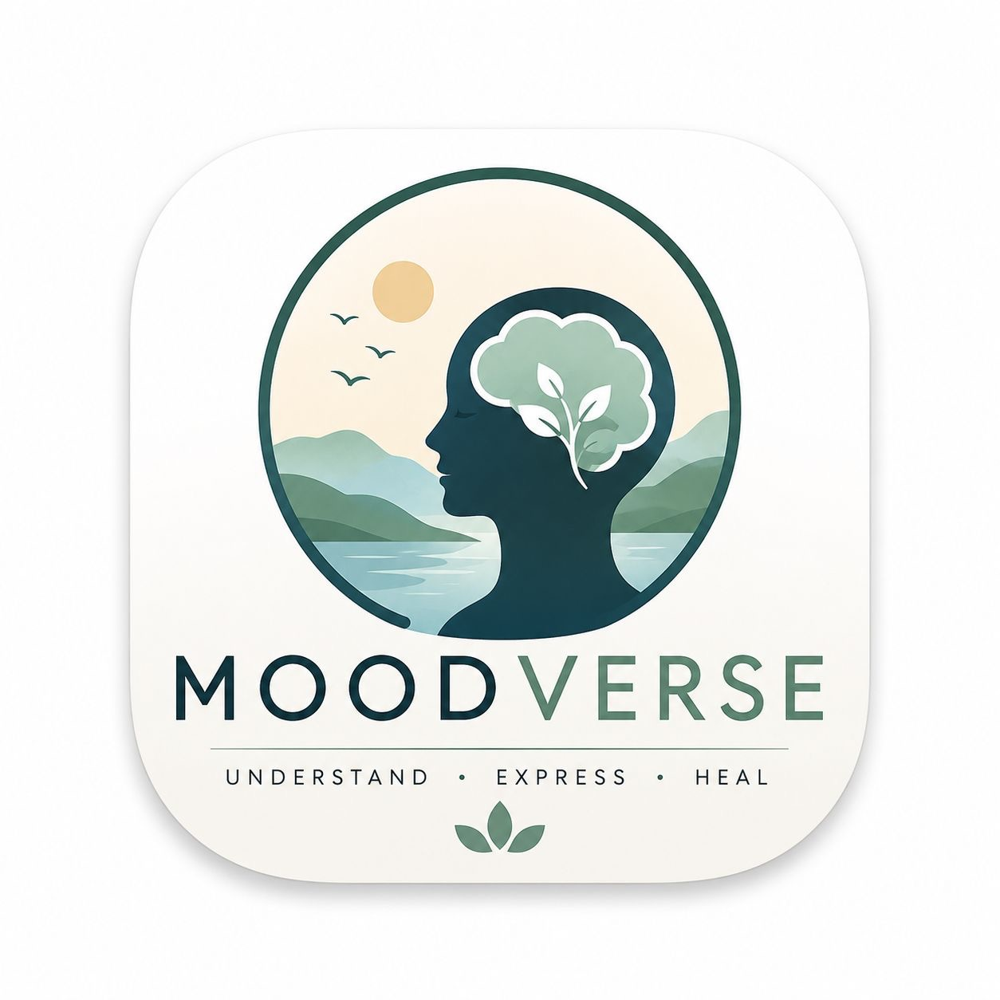
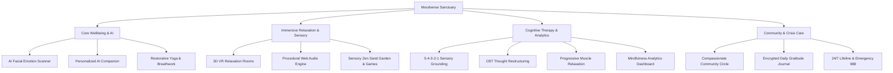

# 🌿 Moodverse — AI-Powered Mental Wellness Sanctuary & Mobile App

<div align="center">



**A Private, Clinically-Informed AI Mental Wellness Sanctuary and Universal Mobile/Web Platform**

*Designed for profound stress reduction, nervous system grounding, cognitive restructuring, and emotional serenity.*

[](https://vitejs.dev/)
[](https://expo.dev/)
[](https://www.typescriptlang.org/)
[](LICENSE)

</div>

---

## 🌟 Executive Overview

**Moodverse** is a multi-modal digital sanctuary engineered to dissolve acute anxiety, alleviate chronic burnout, and cultivate emotional equilibrium. Built with **React 19**, **Vite**, and **Expo (React Native)**, it merges evidence-based cognitive behavioral therapy (CBT) protocols, somatic grounding exercises, procedural Web Audio soundscapes, and immersive 360° VR relaxation spaces into a cohesive, soothing white-pastel aesthetic.

---

## 🧘 Core Architecture & Feature Matrix



---

## ✨ Comprehensive Features

### 1. 🌿 Global Ambient Sound Engine & Instant 4-7-8 Stress Rescue
- **Procedural Web Audio Synthesis (`zenAudio.ts`)**: Generates pure harmonic crystal chimes, Solfeggio frequencies (432Hz Miracle Waves, 528Hz DNA Clarity, 639Hz Heart Harmony), pink-noise rain, and Tibetan bronze singing bowls with zero external audio assets and zero latency.
- **Header Ambient Sound Pill**: 1-click background soundscape player with volume slider and sleep timer across all screens.
- **1-Tap 4-7-8 Parasympathetic Calming Breath**: Scientifically proven respiratory pacemaker with animated visual breathing orb and harmonic chime pacing to slow elevated heart rates within 60 seconds.

---

### 2. 🧠 Therapeutic Sanctuary & Cognitive Self-Care Suite (`/therapy`)
- **5-4-3-2-1 Sensory Grounding Coach**: Multi-step interactive sensory stabilizer for panic, hyperarousal, and dissociation.
- **CBT Thought Reframer & Cognitive Restructuring**: Identifies cognitive distortions (*Catastrophizing*, *All-or-Nothing*, *Mind Reading*, *Emotional Reasoning*) and guides reframing into balanced, empowering truths.
- **Progressive Muscle Relaxation (PMR) Body Scan**: Interactive somatic timer systematically releasing physical tension from forehead, jaw, shoulders, hands, core, and feet.
- **Cosmic Thought Dissolver**: Type acute stressors or toxic thoughts and release them into the cosmos with particle dissolution animations.

---

### 3. 🕶️ 3D VR Relaxation Rooms (`/vr` & `/vr-rooms`)
- **Curated 360° Open-Source Equirectangular Sanctuaries**:
  - *Sechelt Ocean Beach* (Coastal ocean views & sea breeze)
  - *Zen Blossom Park* (Tranquil Japanese botanical garden)
  - *Alpine Mountains* (Snow-capped peaks for mental clarity)
  - *Cerro Toco Horizon* (High-altitude mountain desert under open skies)
  - *Serene Waterway Bridge* (Quiet reflection ponds)
  - *Yokohama Waterfront* (Peaceful coastal night lights)
  - *Minimal Geometric Sanctum* (Abstract floating 3D cubes)
- **Universal WebGL & Three.js/A-Frame Engine** with responsive touch and gyroscope pan controls.

---

### 4. 📊 Mindfulness & Peace Analytics Dashboard (`/dashboard`)
- **Weekly Serenity Level Trend Graph**: Visualizes daily calmness scores and relaxation milestones.
- **Emotional State Distribution Charts**: Tracks the proportion of peaceful, focused, and joyful days.
- **Equilibrium Score & Streak Tracker**: Measures daily mindfulness consistency.
- **Daily Serenity Pulse Logger**: Rate calm level (1–10), log triggers, and export downloadable wellness summaries.

---

### 5. 📖 Private Reflection & Gratitude Haven (`/journal`)
- **Daily Mindful Prompt Generator** with one-click prompt shuffling.
- **3-Point Gratitude Anchors** to solidify positive neural pathways.
- **Sentiment Aura Scoring & Mood Filters** (Peaceful, Grateful, Thoughtful, Healing, Joyful).
- **100% On-Device Encrypted Storage** for complete personal privacy.

---

### 6. 🤝 Compassionate Community Sanctuary Circle (`/community`)
- **Safe Anonymous Sharing Feed** with dedicated channels (*Anxiety Support*, *Gratitude Moments*, *Mindfulness Insights*, *Rest & Burnout*).
- **Compassionate Reaction Tokens**: `🕊️ Send Peace`, `🫂 Warm Hug`, `🌬️ Deep Breath`, `✨ Stay Strong`.
- **Integrated Empathetic AI Care Companion**.

---

### 7. 🎮 Tactile Sensory Play Sanctuary (`/games`)
- **Zen Sand Garden**: Interactive canvas with authentic multi-groove raking physics and smooth river stones.
- **Harmonic Pentatonic Bubble Popper**: Floating bubbles with soothing musical note pops.
- **Mindful Meadow**: Tap-to-plant flower meadow with water droplet audio feedback.
- **Crystal Resonance Keys**: Tuned acoustic piano and kalimba keys.

---

### 8. 🤖 On-Device AI Facial Mood Scanner (`/mood`)
- **Privacy-First Facial Recognition**: Computes micro-expressions locally in browser using WebGL without sending any biometric video frames to external servers.
- **Instant Personalized Action Plan**: Direct recommendations for yoga, breathing rhythms, or VR rooms based on emotional valence.

---

## 🎨 Design Philosophy: Serene White Pastel

| Token Role | Hex Code | Description |
| :--- | :--- | :--- |
| **Primary Background** | `#FAF9F6` | Warm off-white serene parchment background |
| **Card Surface** | `#FFFFFF` | Crisp white elevated container with glassmorphic border |
| **Brand Sky** | `#0284C7` | Tranquil ocean cyan for links, buttons, and focus |
| **Wellness Sage** | `#10B981` | Restorative mint green for peace badges and streaks |
| **Gentle Lavender** | `#6366F1` | Ambient purple for mindfulness and reflection |
| **Support Rose** | `#E11D48` | Gentle rose for 24/7 crisis helplines |
| **Primary Text** | `#0F172A` | Deep slate contrast for WCAG AA typography |

---

## 💻 Tech Stack & Architecture

- **Web Framework**: React 19, Vite 5, React Router v7
- **Mobile Framework**: React Native 0.86, Expo SDK 57 (Expo Go compatible)
- **Navigation**: React Navigation v7 (Native Stack & Bottom Tabs)
- **Data Visualization**: Chart.js 4, React-Chartjs-2
- **Audio & Sensory**: Web Audio API (procedural synthesis), Expo AV
- **3D & VR Rendering**: A-Frame 1.8, Three.js, WebGL
- **Typography & Icons**: Google Fonts (Plus Jakarta Sans & Outfit), Expo Vector Icons (Ionicons)

---

## 🚀 Getting Started

### Prerequisites
- Node.js (v18 or higher)
- npm or yarn
- Optional: **Expo Go** app on iOS / Android for mobile preview

### Installation
```bash
# Clone the repository
git clone https://github.com/srakshitha0802/Moodverse.git
cd Moodverse

# Install dependencies
npm install
```

### Running Locally

#### 1. Web Application (Vite Dev Server)
```bash
npm run dev
# App will run at http://localhost:8100
```

#### 2. Mobile Application (Expo Metro Bundler)
```bash
npm run start
# Scan the QR code with Expo Go (Android) or Camera (iOS)
```

#### 3. Production Web Build
```bash
npm run build
# Generates optimized production assets in dist/
```

---

## 🛡️ Safety & Clinical Disclaimer

> [!IMPORTANT]
> **Moodverse** is an educational wellness platform designed for mindfulness, stress reduction, and emotional support. It is **not** a substitute for clinical psychiatric care, medical diagnosis, or emergency mental health services.
> 
> **If you are experiencing a mental health emergency:**
> - **United States & Canada**: Call or text **988** (Suicide & Crisis Lifeline — Free, 24/7, Confidential)
> - **Crisis Text Line**: Text **HOME** to **741741**
> - **International**: Visit [findahelpline.com](https://findahelpline.com) or contact your local emergency services (112 / 911).

---

## 👥 Authors & Acknowledgments

- **Lead Developer & Creator**: Semala Rakshitha ([@srakshitha0802](https://github.com/srakshitha0802))
- **Email**: rakshithasemala@gmail.com
- **Website**: [moodverse.com](https://moodverse.com)

---

## 📄 License

This project is licensed under the [MIT License](LICENSE).
